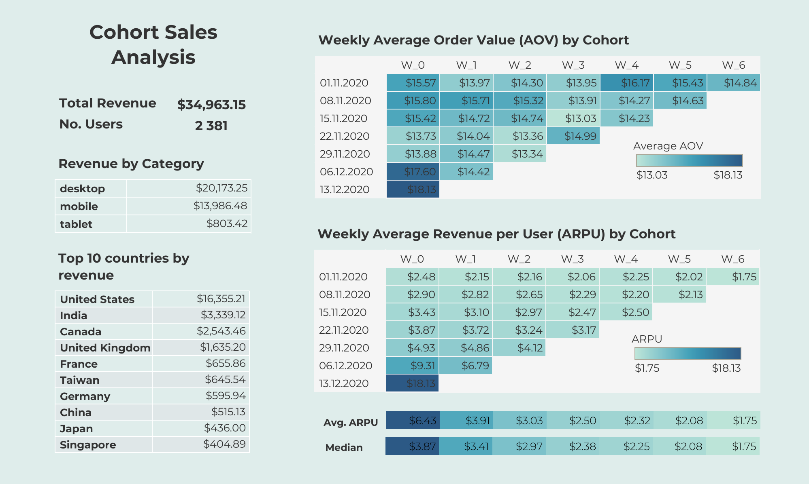
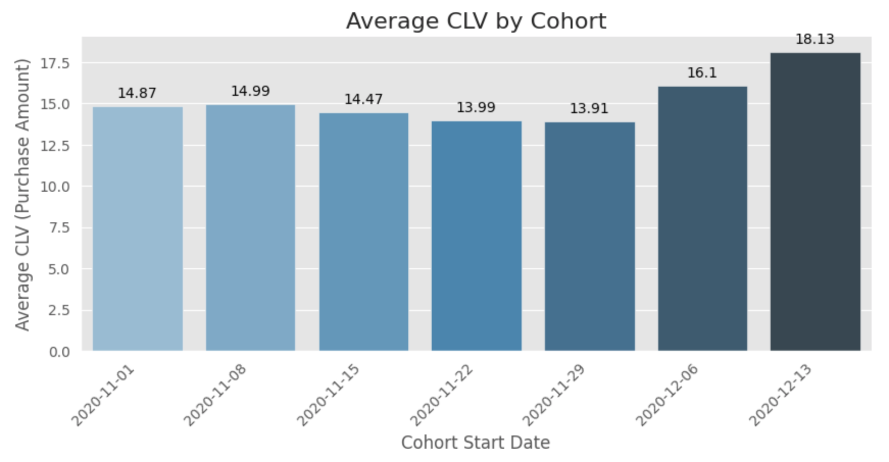
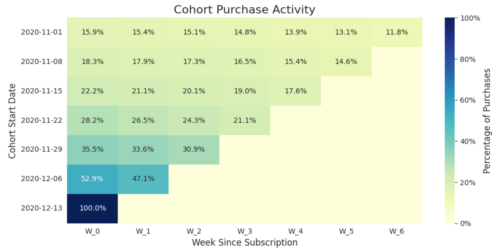
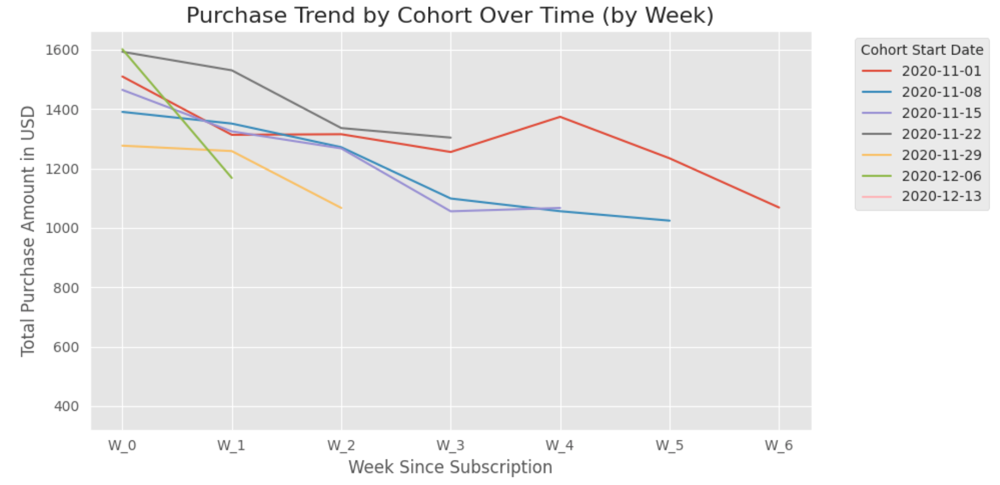

## **Customer Segmentation & Cohort Analysis**

### **Project Overview**

This project presents a complete data analysis workflow, from initial data extraction and cleaning to insightful visualizations and actionable recommendations. The primary goal was to analyze customer behavior and revenue trends to identify key opportunities for business growth.

---

  <b><a href="https://public.tableau.com/views/workfile_17580193858470/Dashboard1?:language=en-US&:sid=&:redirect=auth&:display_count=n&:origin=viz_share_link">Tableau Dashboard</a></b>

### **Analysis Workflow** 📊

A four-stage process was performed to transform raw data into a comprehensive analysis.

* **Data Extraction & Cleaning (SQL):** A dataset of *2,381 rows* and *10 columns* was queried from a BigQuery database, ensuring data integrity by checking for duplicates and missing values.
  
* **Data Enrichment & Quality Check (Google Sheets):** The extracted dataset was imported into Google Sheets for a final manual quality check. An additional column ('Week') was added to prepare the data for cohort analysis.
  
* **Descriptive Statistics (Python):** Using a Google Colab notebook, a Python script calculated key metrics, including *Total Revenue ($34,963.15)* and *Average Customer Lifetime Value (CLV) ($14.68)*. The data was then grouped and analyzed by category, country, and cohort to reveal preliminary insights.
  
* **Visualization & Deep Analysis (Tableau):** The cleaned dataset was loaded into Tableau to create an interactive dashboard focused on cohort-specific behavior, which provided the most impactful findings and supported data-driven recommendations.
  
---

### **Key Findings & Recommendations** ✅

The analysis revealed several critical insights that form the basis for strategic recommendations for marketing and sales teams.

  <b>Average CLV by Cohorts</b>

 

**1. Tablets Drive the Highest Customer Lifetime Value (CLV)** 📱
* **Finding:** While desktop and mobile users represent the majority of customers and revenue, tablet users have a significantly higher average CLV of *$17.09*. This identifies tablet users as a high-value customer segment.
* **Recommendation:** Investigate the specific user experience and behavior of tablet customers. Consider launching a targeted campaign or optimizing the interface for tablet users to capitalize on this valuable segment.

  <b>Weekly Cohort Purchase Activity</b>

 

**2. Newer Cohorts Show Superior Conversion and Value** 🚀
* **Finding:** The most recent cohorts (2020-12-06 and 2020-12-13) exhibit a rapid conversion rate and high initial value. The *2020-12-13* cohort achieved a *100% conversion rate* within its first week with the average CLV of *$18.13*, significantly exceeding the overall average. These two cohorts also display a notably higher *Average Revenue per User (ARPU)* in their early weeks compared to all previous cohorts. This indicates a successful strategy in user acquisition or marketing campaing in the recent period.
* **Recommendation:** Conduct a deeper analysis of the acquisition channels and strategies used for these high-performing cohorts. The goal is to identify and replicate these successful methods to boost conversion speed and value for future user groups.

**3. Revenue is Highly Concentrated in Top 4 Countries** 🌍
* **Finding:** The United States, India, Canada, and the United Kingdom are the top four countries by revenue and user count. Together they account for *68.3% of total revenue*. The United States is the primary market, generating over *$16,000* in revenue.
* **Recommendation:** Focus sales and marketing efforts on these core markets, as they are the main revenue drivers. Simultaneously, explore opportunities for growth in other high-performing regions by creating localized promotions or content to increase their user base and revenue.

  <b>Purchase Trends by Cohorts</b>

 

**4. Revenue Declines Post-Purchase** 📉
* **Finding:** The "Weekly Average Revenue Per User" analysis shows a consistent decline in user value after the initial purchase. While the average order value (AOV) remains stable, the lack of repeat purchases is a challenge for long-term growth.
* **Recommendation:** Develop targeted retention strategies to re-engage users after their first purchase. This could include personalized email campaigns, loyalty programs, or promotions to encourage a second transaction and increase CLV.

---

### **Tools and Technologies** 

The project was conducted using a combination of tools, including SQL, Python, and Tableau.
* **SQL (BigQuery):** Used for initial data extraction and cleaning from a relational database.
* **Google Sheets:** Utilized for initial manual inspection after extraction and dataset enrichment.
* **Python (Google Colab):** Employed for descriptive statistics and data manipulation using libraries like Pandas, NumPy, Matplotlib and Seaborn.
* **Tableau:** The primary tool for creating interactive visualizations and dashboards to uncover deeper insights for each of the cohorts.

---

### **How to Use This Repository**

This repository is structured to allow for a full review of the project's workflow. Here's a guide to navigating the files:
* **sql/:** Contains the SQL script used to query the dataset from BigQuery. You can review the data extraction and cleaning query [here](sql/clv_analysis.sql).
* **notebook/:** The [Google Colab notebook .ipynb file](notebook/CLV_Analysis.ipynb) with the Python code for data cleaning and descriptive statistics. You can run this notebook directly in your browser by clicking the [Colab link](https://colab.research.google.com/drive/1YaF-dJKxhayXqjTTRKofV1kw8sV825IP?usp=sharing). **Note:** you need to have Google account and upload *clv_analysis.csv* file to your Drive. Then you need to update the second code cell in the notebook to define the path to this file in your Drive.  
* **data/:** This folder contains the cleaned [clv_analysis.csv](data/clv_analysis.csv) dataset used in the analysis.
* **tableau/:** The Tableau workbook is developed in Tableau Public and can be accessed via this [link](https://public.tableau.com/views/workfile_17580193858470/Dashboard1?:language=en-US&:sid=&:redirect=auth&:display_count=n&:origin=viz_share_link).
